# CustomUniswap V2 - Decentralized Exchange Interface

A custom smart contract implementation that interfaces with Uniswap V2 protocol on Ethereum Sepolia testnet, providing simplified token swapping and liquidity provision functionality.

## 🚀 Overview

CustomUniswap is a Solidity smart contract that acts as an intermediary layer for interacting with the Uniswap V2 protocol. It simplifies complex DeFi operations like token swaps and liquidity provision while maintaining the security and efficiency of the underlying Uniswap infrastructure.

### Key Features

- **Token Swapping**: Seamless ERC20 token exchanges with automatic routing
- **Liquidity Provision**: Add liquidity to token pairs and earn trading fees  
- **Price Discovery**: Real-time price quotes and slippage calculations
- **Multi-path Routing**: Intelligent routing through WETH for optimal prices
- **Gas Optimization**: Efficient contract design minimizing transaction costs
- **Testnet Ready**: Deployed and tested on Ethereum Sepolia testnet

## 🏗️ Architecture

The contract leverages the battle-tested Uniswap V2 infrastructure while providing a cleaner interface for common DeFi operations.


## 🛠️ Technical Implementation

### Smart Contract Architecture

The contract is built using Solidity ^0.8.20 and integrates with:

- **OpenZeppelin Contracts**: For secure ERC20 interactions and reentrancy protection
- **Uniswap V2 Router**: For executing swaps and liquidity operations
- **Custom Interfaces**: Streamlined interface definitions for optimal gas usage

### Core Functions

#### Token Swapping
```solidity
function swap(
    address _tokenIn,
    address _tokenOut,
    uint _amountIn,
    uint _amountOutMin,
    address _to
) external
```

#### Liquidity Provision
```solidity
function addLiquidity(
    address _tokenA,
    address _tokenB,
    uint _amountA,
    uint _amountB
) external
```

#### Price Calculation
```solidity
function getAmountOutMin(
    address _tokenIn,
    address _tokenOut,
    uint _amountIn
) external view returns (uint)
```

### Routing Logic

The contract implements intelligent routing to optimize trade execution:

```mermaid
flowchart TD
    A[Token Swap Request] --> B{Is WETH involved?}
    B -->|Yes| C[Create 2-hop path]
    B -->|No| D[Create 3-hop path via WETH]
    
    C --> E[TokenA → TokenB]
    D --> F[TokenA → WETH → TokenB]
    
    E --> G[Execute Swap]
    F --> G
    
    G --> H[Return Output Tokens]
    
    subgraph "Path Examples"
        I[WETH → UNIDirect: 2 hops]
        J[USDC → DAIVia WETH: 3 hops]
    end
```



## 📋 Prerequisites

### Development Environment

- **Node.js**: v16.0.0 or higher
- **Foundry**: Latest version for Solidity development
- **Git**: For version control
- **MetaMask**: For testnet interactions

### Required Accounts & APIs

- **Ethereum Wallet**: With Sepolia ETH for gas fees
- **Alchemy Account**: For RPC access to Sepolia testnet
- **Etherscan Account**: For contract verification

## 🚀 Installation & Setup

### 1. Clone the Repository

```bash
git clone https://github.com/yourusername/custom-uniswap-v2.git
cd custom-uniswap-v2
```

### 2. Install Dependencies

```bash
# Install Foundry dependencies
forge install OpenZeppelin/openzeppelin-contracts
forge install uniswap/v2-periphery

# Update remappings
echo "@openzeppelin/contracts/=lib/openzeppelin-contracts/contracts/" > remappings.txt
echo "@uniswap/v2-periphery/=lib/v2-periphery/" >> remappings.txt
```

### 3. Environment Configuration

Create a `.env` file in the project root:

```env
SEPOLIA_RPC_URL=https://eth-sepolia.g.alchemy.com/v2/YOUR_API_KEY
PRIVATE_KEY=your_wallet_private_key_here
ETHERSCAN_API_KEY=your_etherscan_api_key_here
```

### 4. Compile Contracts

```bash
forge build
```

### 5. Run Tests

```bash
forge test -vvv
```

## 🌐 Deployment

### Deploy to Sepolia Testnet

```bash
forge script script/Deploy.s.sol:DeployScript \
--rpc-url $SEPOLIA_RPC_URL \
--private-key $PRIVATE_KEY \
--broadcast \
--verify \
--verifier etherscan \
--etherscan-api-key $ETHERSCAN_API_KEY \
--slow
```

### Verify Deployment

After successful deployment, your contract will be automatically verified on Etherscan. You can interact with it through the Etherscan interface or programmatically.

## 🔧 Usage Examples

### Token Swap Example

```javascript
// Using ethers.js
const customUniswap = new ethers.Contract(contractAddress, abi, signer);

// Approve tokens first
await wethContract.approve(contractAddress, ethers.utils.parseEther("0.1"));

// Execute swap
await customUniswap.swap(
    "0xfFf9976782d46CC05630D1f6eBAb18b2324d6B14", // WETH
    "0x1f9840a85d5af5bf1d1762f925bdaddc4201f984", // UNI
    ethers.utils.parseEther("0.1"),                 // 0.1 WETH
    ethers.utils.parseEther("28"),                  // Min 28 UNI
    userAddress
);
```

### Add Liquidity Example

```javascript
// Approve both tokens
await tokenA.approve(contractAddress, amountA);
await tokenB.approve(contractAddress, amountB);

// Add liquidity
await customUniswap.addLiquidity(
    tokenAAddress,
    tokenBAddress,
    amountA,
    amountB
);
```

## 📊 Contract Addresses

### Sepolia Testnet

| Contract | Address |
|----------|---------|
| CustomUniswap | `0x[DEPLOYED_ADDRESS]` |
| Uniswap V2 Router | `0xeE567Fe1712Faf6149d80dA1E6934E354124CfE3` |
| WETH | `0xfFf9976782d46CC05630D1f6eBAb18b2324d6B14` |

### Supported Tokens

| Token | Symbol | Address |
|-------|--------|---------|
| Wrapped Ether | WETH | `0xfFf9976782d46CC05630D1f6eBAb18b2324d6B14` |
| Uniswap Token | UNI | `0x1f9840a85d5af5bf1d1762f925bdaddc4201f984` |
| Chainlink Token | LINK | `0x779877a7b0d9e8603169ddbd7836e478b4624789` |

## 🔒 Security Considerations

### Implemented Security Measures

- **Reentrancy Protection**: Using OpenZeppelin's ReentrancyGuard
- **Input Validation**: Comprehensive parameter checking
- **Slippage Protection**: Minimum output amount requirements
- **Deadline Protection**: Transaction expiration timestamps

### Best Practices

- Always approve exact amounts needed
- Set appropriate slippage tolerance (5-10%)
- Use deadline parameters for time-sensitive operations
- Test thoroughly on testnet before mainnet deployment


## 📈 Gas Optimization

### Optimization Techniques

- **Batch Operations**: Combining multiple operations in single transaction
- **Efficient Storage**: Minimizing storage reads/writes
- **Assembly Usage**: Low-level optimizations where appropriate
- **Interface Minimization**: Only including necessary function signatures

### Gas Benchmarks

| Operation | Gas Cost (approx.) |
|-----------|-------------------|
| Token Swap (Direct) | ~150,000 gas |
| Token Swap (Routed) | ~200,000 gas |
| Add Liquidity | ~180,000 gas |
| Price Query | ~30,000 gas |

## 🤝 Contributing

### Development Workflow

1. Fork the repository
2. Create a feature branch (`git checkout -b feature/amazing-feature`)
3. Make your changes
4. Add tests for new functionality
5. Ensure all tests pass (`forge test`)
6. Commit your changes (`git commit -m 'Add amazing feature'`)
7. Push to the branch (`git push origin feature/amazing-feature`)
8. Open a Pull Request

### Code Standards

- Follow Solidity style guide
- Include comprehensive comments
- Write unit tests for all functions
- Update documentation for interface changes

## 📚 Resources

### Documentation

- [Uniswap V2 Documentation](https://docs.uniswap.org/protocol/V2/introduction)
- [OpenZeppelin Contracts](https://docs.openzeppelin.com/contracts/)
- [Foundry Book](https://book.getfoundry.sh/)

### Tutorials

- [DeFi Development with Foundry](https://foundry-rs.github.io/foundry/)
- [Uniswap V2 Integration Guide](https://docs.uniswap.org/protocol/V2/guides/smart-contract-integration)

## 📄 License

This project is licensed under the MIT License - see the [LICENSE](LICENSE) file for details.

## ⚠️ Disclaimer

This contract is for educational and testing purposes. It has not undergone professional security audits. Do not use with real funds on mainnet without proper security review and testing.

## 🆘 Support

For questions, issues, or contributions:

- **GitHub Issues**: [Create an issue](https://github.com/yourusername/custom-uniswap-v2/issues)
- **Documentation**: Check the docs folder for detailed guides
- **Community**: Join our Discord for real-time support

**Built with ❤️ for the DeFi community**
